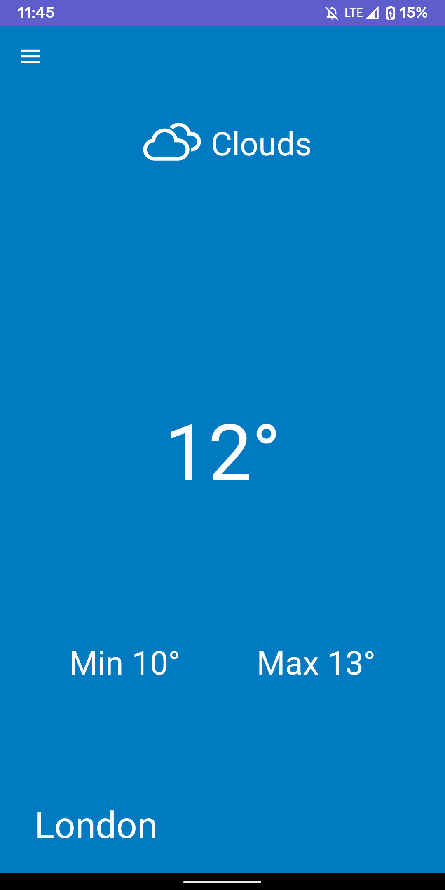
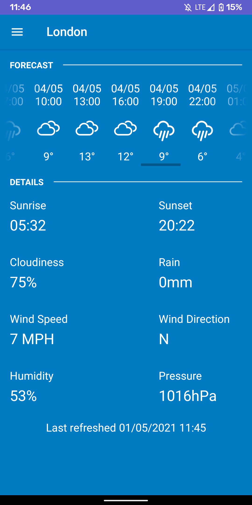
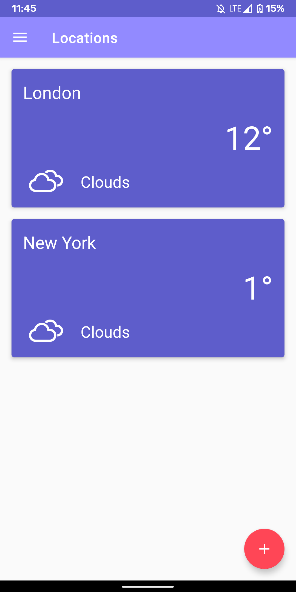
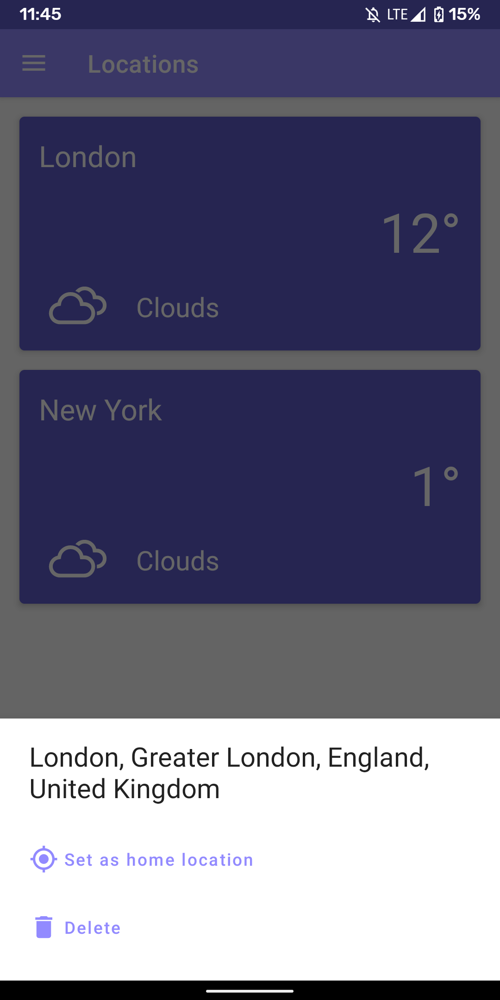
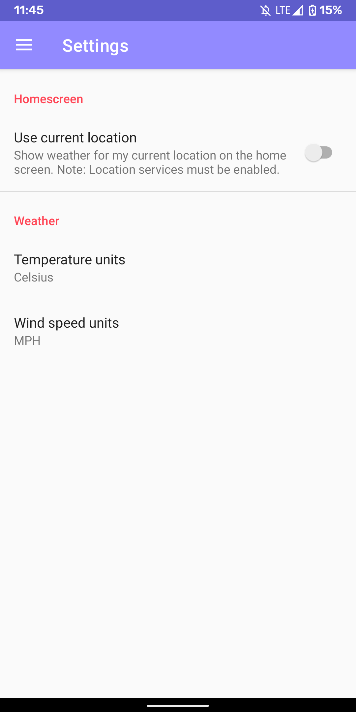

# Glaze
A native Android weather app developing during undergraduate mobile apps module.

## Features
- Receive weather for multiple locations.
- Set location to display on main activity.
- 5 day weather forecast.
- Optionally use location services to get up to date weather for current location.

## Screenshots
  

 

## Licence
```text
Copyright ©2020 Hassie.

Licensed under the Apache License, Version 2.0 (the "License");
you may not use this file except in compliance with the License.
You may obtain a copy of the License at

    http://www.apache.org/licenses/LICENSE-2.0

Unless required by applicable law or agreed to in writing, software
distributed under the License is distributed on an "AS IS" BASIS,
WITHOUT WARRANTIES OR CONDITIONS OF ANY KIND, either express or implied.
See the License for the specific language governing permissions and
limitations under the License.
```
